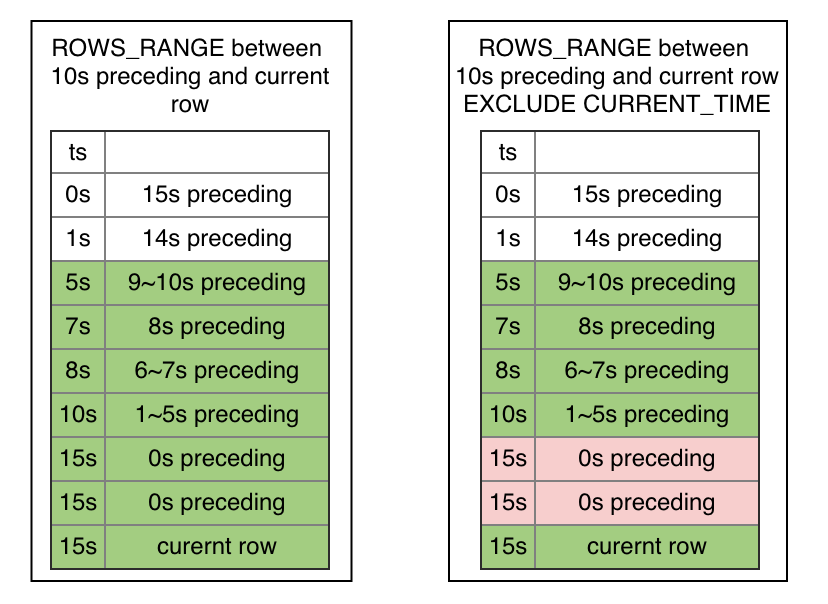
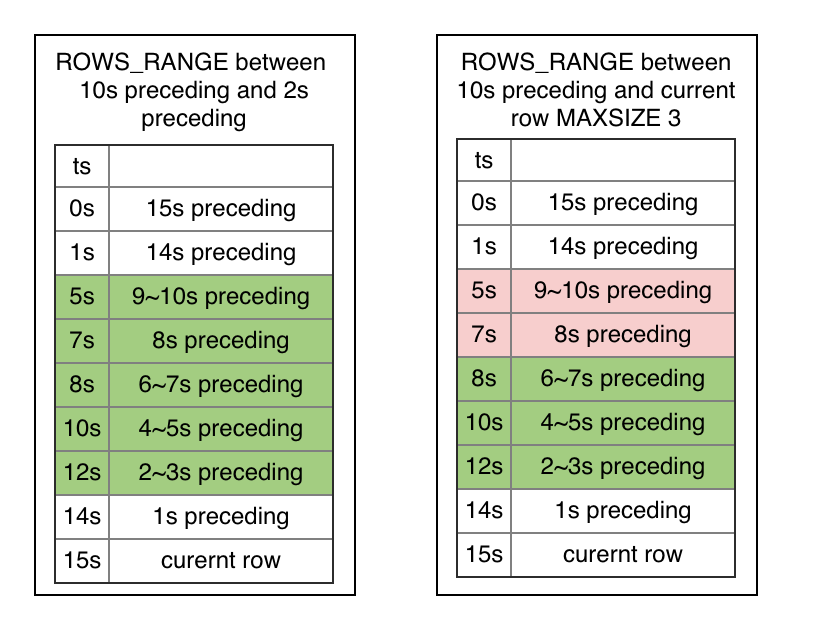
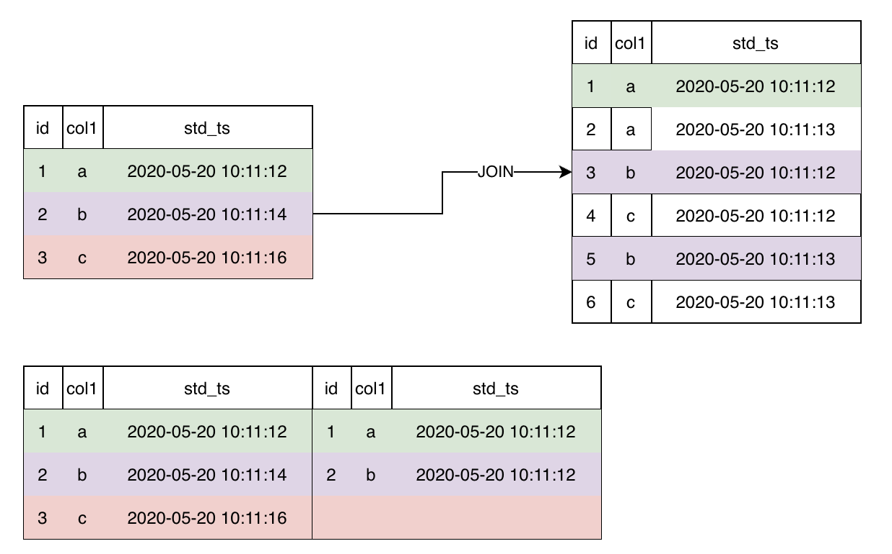

# SQL Query

#### Syntax

```sql
query_statement:
    query_expr

query_expr:
    SELECT [DISTINCT] [projection, ...] FROM table_reference [, table_reference ...]
			 [where clause] [group clause] [having clause] [order clause] [window clause] [limit clause]

/* SQL Table Reference syntax */
table_reference： 
	{table_factor | join clause | last join clause | union clause | }

table_factor: 
	{ table_name | table_name AS table_name }
```

#### Limitations

| Type         | Limitations                                                  | Example                                   |
| :----------- | :----------------------------------------------------------- | ----------------------------------------- |
| SIMPLE QUERY | Most of simple queries are supported                         | `SELECT col1 FROM t1;`                    |
| GROUP        | Only supported on  `BATCH MODE`. Group expressions are limited to `COLUMN` expression | `SELECT SUM(col1) from t1 GROUP BY col2;` |
| WHERE        | Only on `BATCH MODE`.                                        |                                           |
| LIMIT        | Only supported on `BATCH MODE`.                              |                                           |
| WINDOW       | Supprted. And we invented some new traits of `WINDOW`        |                                           |
| LAST JOIN    | New SQL traits targeting OLDA system.                        |                                           |

### 1. SIMPLE QUERY Statement

**Simple query statement** is a kind of select statement with simple structure. For example, it only  deal with  one single table and doesn't handle complex [relational algebra](https://en.wikipedia.org/wiki/Relational_algebra)(e.g., Filter, Group, Join, Union).

#### Syntax

```SQL
simple_select:
	SELECT [DISTINCT] [projection, ...] FROM table_name 

/*SQL expression projection syntax*/
projection: { sql_expr [AS SQL_IDENTIFIER] | * }

```

#### Example

```sql

-- desc: SELECT with rename
  SELECT COL1 as c1 FROM t1;
 
-- desc: SELECT ALL
  SELECT * FROM t1;
 
-- desc: SELECT const expression
	SELECT 1, 2.0, 'Hello' from t1;
	
-- desc: SELECT column 
  SELECT COL1 FROM t1;
  SELECT t1.COL1 FROM t1;
 
-- desc: SELECT unary expression
  SELECT -COL2 as COL2_NEG FROM t1;
  
-- desc: SELECT binary expression
  SELECT COL1 + COL2 as COL12_ADD FROM t1;
 
 -- desc: SELECT with type cast
  SELECT CAST(COL1 as INT) as COL_INT FROM t1;
  
-- desc: SELECT udf
  SELECT substr(col1, 3, 6);
```


### 2. WINDOW Statement

#### Window Type

We introduce a novel types of window frame **ROWS_RANGE**. It works well for same AI application where executions in batch mode and request mode are expected strictly consistent.

The figure below demestrate the differences between the **ROWS**, **ROWS_RANGE**, and **RANGE** window frame. (**RANGE** window frame will be supprted in the future)


#### Frame Bound Type

| Options                 | Description                                                  |
| :---------------------- | :----------------------------------------------------------- |
| CURRENT ROW             | For `ROWS`, the bound is the current row.For `ROWS_RANGE`, the bound is the current row. For `RANGE`, the bound is the peers of the current row.Peers of the current row： 表示当前行order值相同的行 |
| UNBOUNDED PRECEDING     | The bound is the first partition row.                        |
| `UNBOUNDED FOLLOWING`   | The bound is the last partition row.                         |
| *`expr`* PRECEDING      | For `ROWS`, the bound is *`expr`* rows before the current row.For `ROWS_RANGE`, the bound is the rows with values **equal** to the current row value minus *`expr.`*if the current row value is `NULL`, the bound is the current row.For `RANGE`, the bound is the rows with values **equal** to the current row value minus *`expr.`*if the current row value is `NULL`, the bound is the peers of the current row. |
| *`expr`* FOLLOWING      | For `ROWS`, the bound is *`expr`* rows before the current row.For `ROWS_RANGE`, the bound is the rows with values **equal** to the current row value plus *`expr.`*if the current row value is `NULL`, the bound is the current row.For `RANGE`, the bound is the rows with values **equal** to the current row value plus *`expr.`*if the current row value is `NULL`, the bound is the peers of the current row. |
| *`expr`* OPEN PRECEDING | For `ROWS`, the bound is *`expr-1`* rows before the current row.For `ROWS_RANGE`, the bound is the rows with values **less than** to the current row value minus *`expr.`*if the current row value is `NULL`, the bound is the current row.For `RANGE`, the bound is the rows with values **less than** to the current row value minus *`expr.`*if the current row value is `NULL`, the bound is the peers of the current row. |
| *`expr`* OPEN FOLLOWING | For `ROWS`, the bound is *`expr`* rows before the current row.For `ROWS_RANGE`, the bound is the rows with values **less than** to the current row value plus *`expr.`*if the current row value is `NULL`, the bound is the current row.For `RANGE`, the bound is the rows with values **less than** the current row value plus *`expr.`*if the current row value is `NULL`, the bound is the peers |

#### Syntax

```SQL
window_clause: 
	WINDOW window_definition [, window_definition ...]
	
window_definition:
    WINDOW window_name AS window_specification
    
window_specification: 
	[window_union_clause] PARTITION BY column_ref [,column_ref ...] ORDER BY column_ref frame_clause [EXCLUDE CURRENT_TIME] [INSTANCE_NOT_IN_WINDOW]
 
frame_clause:
    frame_units frame_extend [opt_frame_size]
 
frame_units:
    {ROWS|ROWS_RANGE}
 
opt_frame_size:
    MAXSIZE const_expr
 
frame_extent:
    frame_between|frame_start

frame_between:
    BETWEEN frame_start AND frame_end
 
frame_start, frame_end: {
    CURRENT ROW
  | UNBOUNDED PRECEDING
  | UNBOUNDED FOLLOWING
  | expr PRECEDING
  | expr FOLLOWING
  | expr OPEN PRECEDING
  | expr OPEN FOLLOWING
 
window_union_clause:
    UNION table_ref [, table_ref ...]
 
table_ref:
    {table_name | sub_query }

}
```

#### Examples

**Named Window**

```SQL
-- 
SELECT sum(col2) OVER w1 as w1_col2_sum FROM t1
WINDOW w1 AS (PARTITION BY col1 ORDER BY col5 ROWS BETWEEN 3 PRECEDING AND CURRENT ROW)
```

**Anonymous Window**

```SQL
SELECT id, pk1, col1, std_ts,
sum(col1) OVER (PARTITION BY pk1 ORDER BY std_ts ROWS BETWEEN 1 PRECEDING AND CURRENT ROW) as w1_col1_sum
from t1;
```

**ROWS frame Window**

```SQL
-- ROWS example
-- desc: window ROWS, 前1000条到当前条
SELECT sum(col2) OVER w1 as w1_col2_sum FROM t1
WINDOW w1 AS (PARTITION BY col1 ORDER BY col5 ROWS BETWEEN 1000 PRECEDING AND CURRENT ROW);
```

**ROWS_RANGE frame Window**

```SQL
-- ROWS example
-- desc: window ROWS, 前1000条到当前条
SELECT sum(col2) OVER w1 as w1_col2_sum FROM t1
WINDOW w1 AS (PARTITION BY col1 ORDER BY col5 ROWS_RANGE BETWEEN 1000s PRECEDING AND CURRENT ROW);
```


####  New SQL Trait：WINDOW UNION

**window with union single table**

```SQL
SELECT col1, col5, sum(col2) OVER w1 as w1_col2_sum FROM t1
WINDOW w1 AS (UNION t2 PARTITION BY col1 ORDER BY col5 ROWS_RANGE BETWEEN 10s PRECEDING AND CURRENT ROW) limit 10;
```


**window with union multiple tables**

```SQL
SELECT col1, col5, sum(col2) OVER w1 as w1_col2_sum FROM t1
WINDOW w1 AS (UNION t2, t3 PARTITION BY col1 ORDER BY col5 ROWS BETWEEN 3 PRECEDING AND CURRENT ROW) limit 10;
```


**window with union while instance rows do not enter window**

```SQL
SELECT col1, col5, sum(col2) OVER w1 as w1_col2_sum FROM t1
WINDOW w1 AS (UNION t2 PARTITION BY col1 ORDER BY col5 ROWS BETWEEN 3 PRECEDING AND CURRENT ROW INSTANCE_NOT_IN_WINDOW) limit 10;
```


**window with union subquery**

```SQL
SELECT col1, col5, sum(col2) OVER w1 as w1_col2_sum FROM t1
WINDOW w1 AS
(UNION (select c1 as col1, c2 as col2, 0.0 as col3, 0.0 as col4, c5 as col5, "NA" as col6 from t2),
(select c1 as col1, c2 as col2, 0.0 as col3, 0.0 as col4, c5 as col5, "NA" as col6 from t3)
PARTITION BY col1 ORDER BY col5 ROWS BETWEEN 3 PRECEDING AND CURRENT ROW) limit 10;
```


#### New SQL Trait：Exclude CURRENT_TIME

**ROWS_RANGE frame Window and  EXCLUDE CURRENT_TIME**

```SQL
-- ROWS_RANGE EXCLUDE CURRENT_TIME example
-- desc: window ROWS, from 1000s preceding to current row, excluding rows at current time except current row
SELECT sum(col2) OVER w1 as w1_col2_sum FROM t1
WINDOW w1 AS (PARTITION BY col1 ORDER BY col5 ROWS_RANGE BETWEEN 1000s PRECEDING AND CURRENT ROW EXCLUDE CURRENT_TIME);
```



#### New SQL Trait： MAXSIZE

We introduce new window option `MAXSIZE`. It limits the max size of window.



**ROWS_RANGE Window with max size**

```sql
-- ROWS_RANGE with max size examples
-- desc: Window ROWS_RANGE from 10s preceding to current row and the window size can't exceed max_size
SELECT count(col2) OVER w1 as w1_col2_cnt FROM t1 WINDOW 
w1 AS (PARTITION BY col1 ORDER BY col5 ROWS_RANGE BETWEEN 10s PRECEDING AND CURRENT ROW) limit 10;
```

### 3. LAST JOIN Statement
`LAST JOIN` can be regarded as a variant of  `LEFT JOIN`, saying it can only pick up one **last** row from all matched rows under given condition.

#### Syntax

```SQL
last_join_clause:
    table_ref last_join_item [ last_join_item ...]
last_join_item:
    LAST JOIN table_ref [ORDER BY order_col] ON expr
   
table_ref:
    {table_name | sub_query}
```

**LAST JOIN without ORDER BY**

```sql
-- desc: query last join without ORDER BY

SELECT t1.col1 as t1_col1, t2.col1 as t2_col2 from t1 LAST JOIN t2 ON t1.col1 = t2.col1
```



Join result as followed:


**LAST JOIN with ORDER BY**

```SQL
-- desc: Last Join with ORDER BY
SELECT t1.col1 as t1_col1, t2.col1 as t2_col2 from t1 LAST JOIN t2 ORDER BY ts.std_ts ON t1.col1 = t2.col1
```


Joined result as followed:


#### Limitations

last join有两种用法:

1. Last Join with ORDER BY
   1. 在性能敏感模式下（在RTDIB环境下）要求JOIN条件和ORDER BY列都能命中索引
2. Last Join without ORDER BY 在性能敏感模式下（如RTIDB环境下）：
   1. 如果是行拼接（右边部分是一个Row)，则没有边界限制
   2. 如果是表拼接（右边部分是Table), 要求JOIN条件命中右表索引。

### 4. Group Statement

#### Syntax

```SQL
SELECT [projection, ...] FROM table_name GROUP BY sql_expr, [sql_expr ...]
```

#### Limitations

`Group By` is experimental. It is unsupported in request-mode and it has some limitations.

| 语句类型                   | 状态                        |
| :------------------------- | :-------------------------- |
| Group by column expression | Unsupported in request mode |
| Group by other expression  | Unsupported                 |

#### Examples

```SQL
-- desc: group by column
  SELECT COL1 FROM t1 group by COL1;
-- desc: group by multi columns
  SELECT COL1, COL2 FROM t1 group by COL1, COL2;
-- desc: group by column
  SELECT COL1, SUM(COL2) FROM t1 group by COL1;
-- desc: group by multi columns
  SELECT COL1, COL2, SUM(COL3) FROM t1 group by COL1, COL2;
```

### 5 . Where Statement

#### Syntax

```SQL
SELECT [projection, ...] FROM table_name WHERE sql_expr
```

#### Limitations

| 语句类型 | 状态                        |
| :------- | :-------------------------- |
| Where    | Unsupported in request mode |

#### Examples

```SQL
-- desc: SELECT with simple filtering
  sql: SELECT COL1 FROM t1 where COL1 > 10;
-- desc: SELECT with complex filtering
  sql: SELECT COL1 FROM t1 where COL1 > 10 and COL2 = 20 or COL1 =0;
```

### 6. Limit Statement

#### Syntax

```SQL
SELECT ... LIMIT INT_NUM
```

#### Examples

```SQL
-- desc: SELECT Limit
  SELECT t1.COL1 c1 FROM t1 limit 10;
```

