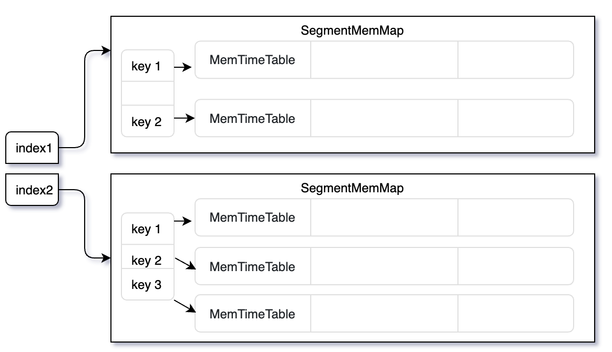

# 实现一个简单内存表SQL引擎

​		本文旨在帮助开发者在C/C++项目中，使用C++编程接口用[HybridSE的C++SDK](./api/c++/SUMMARY.md)打造自己的SQL引擎。考虑到存储系统并非本文关注的重点，我们将简化存储层——使用内存表作为底层存储，这可以让我们更好关注引擎实现以及存储系统适配这些细节。

在深入详述实现细节以前，让我们简要概述实现一个简单内存表SQL引擎需要的步骤：

1. 设计内存表结构
2. 实现数据接口(`Catalog`, `TableHandler`)子类: `SimpleCatalog`,`SimpleTableHandler`
3. 构造和执行引擎

## 1. 内存表存储



```c++
typedef std::deque<std::pair<uint64_t, Row>> MemTimeTable;
typedef std::map<std::string, MemTimeTable> MemSegmentMap;
```

- 内存表支持多个索引，并为每个索引维护一个`SegmentMemMap`。换言之，每个SegmentMemMap都有可以进行全表遍历。
- `SegmentMemMap`是`key`到时序表`MemTimeTable`的映射。`key`是根据数据的索引表达式值。`key`相同的数据按时间排序后组织成`MemTimeTable`，最终关联到`key`上。

## 2. 实现数据接口

### [SimpleCatalog](https://github.com/4paradigm/HybridSE/blob/main/src/vm/simple_catalog.h)

想要开发HybridSE引擎，首先要实现与所在存储系统相适应`Catalog`。这意味着，需要实现数据集元信息的查询接口以及数据访问接口。

#### 内部接口

使用`database_`和`table_handler`来维护和管理数据库和表信息。其中, `type::Database`HybridSE标准的数据库类型，`SimpleCatalogTableHandler`的实现则会在下一小节会阐述。

#### 接口实现

我们列出几处关键的函数和接口实现（更多细节可查阅[simple_catalog.h](https://github.com/4paradigm/HybridSE/blob/main/src/vm/simple_catalog.h)和[simple_catalog.cc](https://github.com/4paradigm/HybridSE/blob/main/src/vm/simple_catalog.cc)）

- 构造函数

`SimpleCatalog`的构造函数几乎没有额外工作，进提供`index-based-optimzation`的开关初始化。这意味在，初始化后的`SimpleCatalog`的数据库元信息和数据都是空的。

```c++
SimpleCatalog::SimpleCatalog(const bool enable_index)
    : enable_index_(enable_index) {}
SimpleCatalog::~SimpleCatalog() {}
bool SimpleCatalog::IndexSupport() { return enable_index_; }
```

- 数据库、表元信息查询接口

```c++
std::map<std::string, std::shared_ptr<type::Database>> databases_;
std::map<std::string,
             std::map<std::string, std::shared_ptr<SimpleCatalogTableHandler>>>
        table_handlers_;
```

```c++
std::shared_ptr<type::Database> SimpleCatalog::GetDatabase(
    const std::string &db_name) {
    return databases_[db_name];
}
```

```c++
std::shared_ptr<TableHandler> SimpleCatalog::GetTable(
    const std::string &db_name, const std::string &table_name) {
    auto &dict = table_handlers_[db_name];
    return dict[table_name];
}
```

- 数据操作

对于`Catalog`来说，[`AddDatabase` ](https://github.com/4paradigm/HybridSE/blob/main/src/vm/simple_catalog.cc#L26)和 [`InsertRows` ](https://github.com/4paradigm/HybridSE/blob/main/src/vm/simple_catalog.cc#L48)都不是必须的。我们引入这两个操作方便添加元数据和数据。

### SimpleCatalogTableHandler

[`SimpleCatalogTableHandler`](https://github.com/4paradigm/HybridSE/blob/main/src/vm/simple_catalog.h#L33)是我们为Simple Engine实现的`TableHandler`。

#### 内部结构

首先，它在内部维护`table_storage`来维护完整的[内存表存储](#1. 内存表存储)：

``` c++
std::map<std::string, std::shared_ptr<MemPartitionHandler>> table_storage;
```

其中，`MemPartitionHandler`就是`MemSegmentMap`的`TableHandler`实现，它内部就维护一个`MemSegmentMap`。使用`MemPartitionHandler`可以方便实现`GetIterator`,`GetWindowIterator`接口。

此外，它还维护了一个`full_table_storage_`,来维护无索引场景下的全表内存。这种设计对是对内存的浪费，但我们作为演示，性能不是我们考虑的重点。

```c++
std::shared_ptr<MemTableHandler> full_table_storage_;
```


#### 接口实现

我们列出几处关键函数和接口实现（更新细节可查阅[simple_catalog.h](https://github.com/4paradigm/HybridSE/blob/main/src/vm/simple_catalog.h#L33)和[simple_catalog.cc](https://github.com/4paradigm/HybridSE/blob/main/src/vm/simple_catalog.cc#L64):

- 构造函数

`SimpleCatalogTableHandler`的构造函数通过分析传入的数据库名和表的`TableDef`来初始化表的元信息，包括表类型信息`TableDef`,索引列表`IndexHint`,列类型信息`Types`等。

- 数据库、表元信息查询接口

直接返回初始化好的各类表、索引、列信息即可

```c++
const Types &SimpleCatalogTableHandler::GetTypes() { return this->types_dict_; }

const IndexHint &SimpleCatalogTableHandler::GetIndex() {
    return this->index_hint_;
}

const Schema *SimpleCatalogTableHandler::GetSchema() {
    return &this->table_def_.columns();
}

const std::string &SimpleCatalogTableHandler::GetName() {
    return this->table_def_.name();
}

const std::string &SimpleCatalogTableHandler::GetDatabase() {
    return this->db_name_;
}
```

- GetWindowIterator

使用`MemPartitionHandler`使得分组迭代器`GetWindowIterator()`的实现变得很简单，仅需要根据`index_name`找到对应的分组表`MemPartitionHandler`，然后直接调用`MemPartitionHandler->GetWindowIterator()`。更多细节请查询[mem_catalog.cc](https://github.com/4paradigm/HybridSE/blob/main/src/vm/mem_catalog.cc#L159)

```c++
std::unique_ptr<WindowIterator> SimpleCatalogTableHandler::GetWindowIterator(
    const std::string &index_name) {
    if (table_storage.find(index_name) == table_storage.end()) {
        return nullptr;
    } else {
        return table_storage[index_name]->GetWindowIterator();
    }
}
```

- GetIterator

使用`MemTableHandler`使得全表迭代`GetIterator()`的实现变得很简单：

```c++
std::unique_ptr<RowIterator> SimpleCatalogTableHandler::GetIterator() {
    return full_table_storage_->GetIterator();
}
```

更多细节请查询[MemTableHandler::GetIterator()](https://github.com/4paradigm/HybridSE/blob/main/src/vm/mem_catalog.cc#L239)

- GetCount和At接口

对于没有准备好支持的接口，可以返回一些默认值，并打印ERROR日志。很遗憾，目前HybridSE还没有错误系统来管理这些错误。

```c++
const uint64_t SimpleCatalogTableHandler::GetCount() { 
  LOG(ERROR) << "Unsupported operation: GetCount()";
  return 0; 
}
hybridse::codec::Row SimpleCatalogTableHandler::At(uint64_t pos) {
    LOG(ERROR) << "Unsupported operation: At()";
    return hybridse::codec::Row();
}
```


## 3. 构造和执行引擎

### 构建引擎

- 配置引擎`EngineOption`

我们简单只用默认引擎配置`EngineOptions options;`

- 构造`SimpleCatalog`

```c++
// build Simple Catalog
    auto catalog = std::make_shared<SimpleCatalog>(true);
    // database simple_db
    fesql::type::Database db;
    db.set_name("simple_db");

    // prepare table t1 schema and data
    fesql::type::TableDef table_def;
    {
        table_def.set_name("t1");
        table_def.set_catalog("db");
        {
            ::fesql::type::ColumnDef* column = table_def.add_columns();
            column->set_type(::fesql::type::kVarchar);
            column->set_name("col0");
        }
        {
            ::fesql::type::ColumnDef* column = table_def.add_columns();
            column->set_type(::fesql::type::kInt32);
            column->set_name("col1");
        }
        {
            ::fesql::type::ColumnDef* column = table_def.add_columns();
            column->set_type(::fesql::type::kInt64);
            column->set_name("col2");
        }
    }
    *(db.add_tables()) = table_def;
    catalog->AddDatabase(db);
```

- 准备数据库数据

```c++
		// insert data into simple_db
    std::vector<Row> t1_rows;
    for (int i = 0; i < 10; ++i) {
        std::string str1 = "hello";
        codec::RowBuilder builder(table_def.columns());
        uint32_t total_size = builder.CalTotalLength(str1.size());
        int8_t* ptr = static_cast<int8_t*>(malloc(total_size));
        builder.SetBuffer(ptr, total_size);
        builder.AppendString(str1.c_str(), str1.size());
        builder.AppendInt32(i);
        builder.AppendInt64(1576571615000 - i);
        t1_rows.push_back(Row(base::RefCountedSlice::Create(ptr, total_size)));
    }
    if (!catalog->InsertRows("simple_db", "t1", t1_rows)) {
        return SIMPLE_ENGINE_DATA_ERROR;
    }
```

- 构造`Engine`示例

```c++
Engine engine(catalog, options);
```

### 编译和运行

- 编译

```c++
std::string sql = "select col0, col1, col2, col1+col2 as col12 from t1;";
base::Status get_status;
BatchRunSession session;
// compile sql
if (!engine.Get(sql, "simple_db", session, get_status) ||
    get_status.code != common::kOk) {
  return SIMPLE_ENGINE_COMPILE_ERROR;
}
```

- 执行

```c++
std::vector<Row> outputs;
// run sql query
if (0 != session.Run(outputs)) {
  return SIMPLE_ENGINE_RUN_ERROR;
}
// print result
PrintRows(session.GetSchema(), outputs);
```

## 4. 运行SimpleEngineDemo

```shell
cd hybridse/build
cmake .. 
make simple_engine_demo
./src/simple_engine_demo
```

