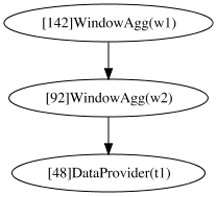
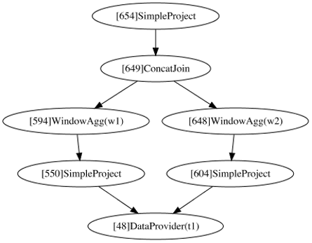

# 多窗口并行计算优化

## 介绍

在使用Spark做特征过程的场景中，同时计算多个窗口特征是非常常见的。标准Spark默认只支持串行执行窗口，在性能和资源利用率上都很大的改进空间，SparkFE则原生支持多窗口并行计算优化。

以下面的简单SQL为例介绍SparkFE的多窗口并行计算优化方案。

```
SELECT 
  min(age) OVER w1 as w1_min_age, 
  min(age) OVER w2 as w2_min_age 
FROM t1 
WINDOW 
  w1 as (PARTITION BY name ORDER by age ROWS BETWEEN 10 PRECEDING AND CURRENT ROW), 
  w2 as (PARTITION BY age ORDER by age ROWS BETWEEN 10 PRECEDING AND CURRENT ROW)"
```

## Spark多窗口特征计算

针对上面的SQL应用，标准Spark生成的逻辑计划和物理计划图如下。



在任务执行时，必须保证第一个窗口完全计算完成，才可以进行下一个窗口计算。因为窗口计算是需要进行分区的，如果分区中出现数据倾斜的情况，那两个窗口计算都需要等待最慢的分区完成才可以继续，不能充分利用整个集群的计算资源。


## SparkFE多窗口特征并行计算

SparkFE提供了多窗口并行计算优化的配置开关，参考[SparkFE配置](../usage/sparkfe_configuration.md)文档，可以通过以下配置来开启多窗口并行计算优化。

| 配置项 | 说明 | 默认值 | 备注 |
| ----- | --- | ----- | ---- |
| sparkfe.window.parallelization | 是否启动窗口并行计算优化 | false | 窗口并行计算可提高集群利用率但增加计算节点 |

开启配置后，针对上面的SQL应用，SparkFE生成的逻辑计划以及最终的Spark计划如下。



多窗口并行需要实现一个ConcatJoin功能，把同一行生成的多个窗口特征拼接起来，这里也可以使用[原生LastJoin实现](./native_last_join_optimization.md)进行拼接优化。相比于串行实现，多窗口并行计算虽然会多增加一些数据操作，但多个窗口在资源足够的情况下并行计算，在部分场景下可以达到数倍的性能提升，尤其在出现数据倾斜等情况下能更好地利用集群的物理资源。
