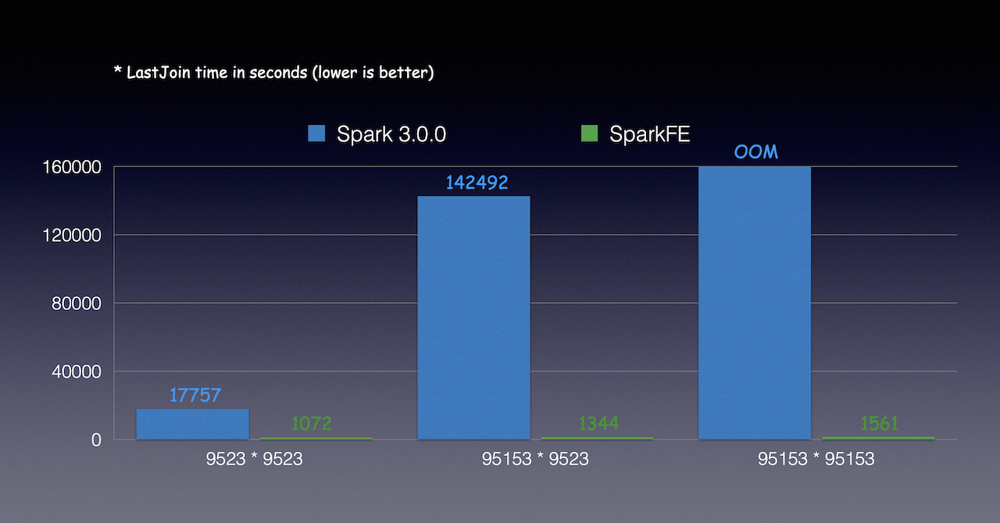

# Native LastJoin Optimization

## Introduction

Last Join is the new join type for machine learning in SparkFE. For more detail, please refer to [HybridSE Language Guide](../../hybridse/language_guide/reference.md).

## Implementation Of LastJoin

According to the semantic of LastJoin, the number of rows from joined table is the same as the number of the left table. Currently the inner join and outer join from standard SQL could not need the requirement. If we use Spark to implement LastJoin, here are the procedures.

1. Add the index column for left join and make sure each line has the unique ID
2. Use left outer join for left and right table
3. Reduce by the index column for the joined table

Here is the basic implementation with Spark APIs.

```
val indexColumnName = "indexCol"
val orderbyColmn = "orderbyCol"

val t1WithIndex = t1.withColumn(indexColumnName, monotonically_increasing_id())
val t3 = t1WithIndex.join(t2, t1WithIndex("id") === t2("u_id"), "left_outer")

val customOrder = new Ordering[Row]() {
    override def compare(x: Row, y: Row): Int =
    Ordering[Long].compare(x.getAs[Long](orderbyColmn), y.getAs[Long](orderbyColmn))
}

val t4 = t3.groupByKey(row => row.getAs[Long](indexColumnName)).mapGroups {
    case (k, iter) => {
    val maxRow = iter.max(customOrder)
    (maxRow.getAs[Int](0), maxRow.getAs[String](1), maxRow.getAs[String](2), maxRow.getAs[Int](3), maxRow.getAs[Long](4), maxRow.getAs[Int](6), maxRow.getAs[String](7), maxRow.getAs[Long](8))
    }
}
```

Obviously the performance of LastJoin is wrose than LeftJoin but the processing data is much smaller than the latter one. Because Spark does not support native LastJoin and have no extension APIs to implement the new join type which require users to reduce after join.

## Implementation Of Native LastJoin

Considering that LastJoin has more usage in machine learning, SparkFE support implementation of the native LastJoin. It reduce the network transformation and data for computation. The implementation of native LastJoin is like other join types in Spark. It supports the new join type and can be used in BrocastHashJoin, SortMergeJoin and ShuffleHashJoin.

The detail of implementaion can be found in `spark` submodule of SparkFE.

## Performance

For the scenarios of LastJoin without order-by condiction, here is the benchmark result of Spark and SparkFE.


