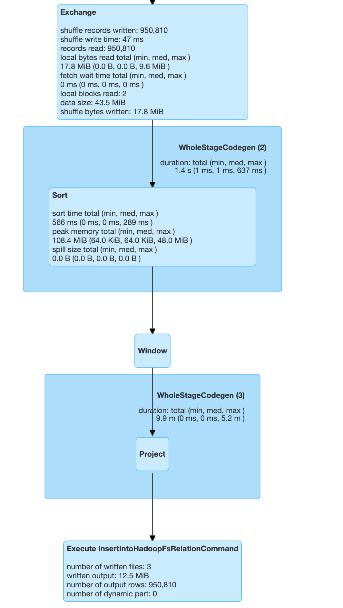
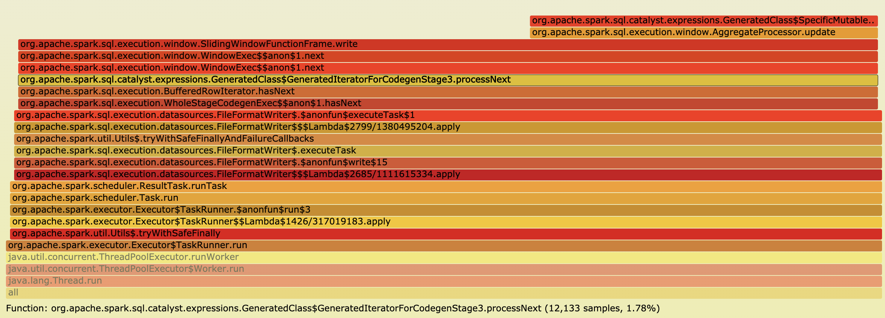
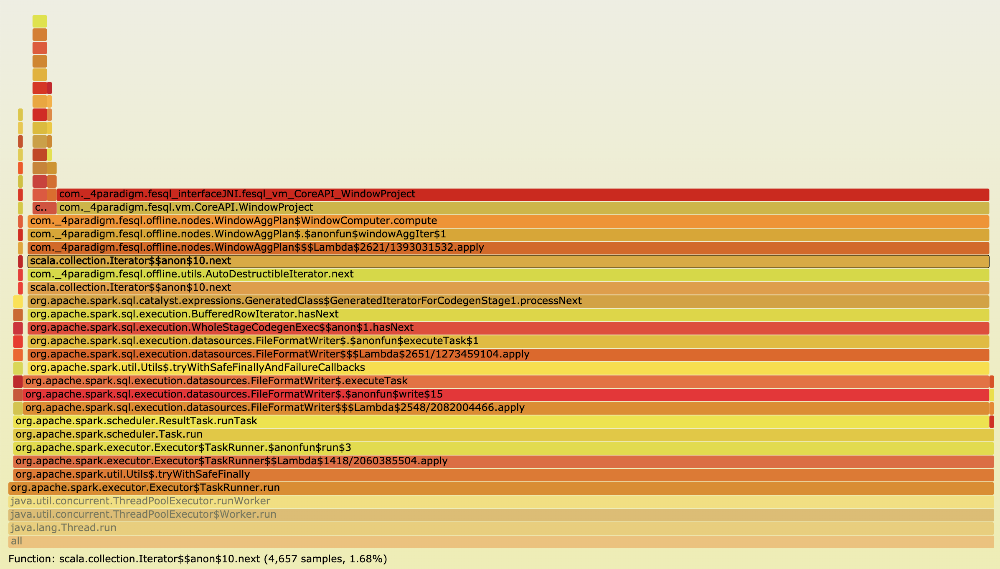

# Native Window Computing

## Introduction

SparkFE is optimized for AI and FE, especially for supporting time serial features which has significant performance improvement than standard Spark.

## Over Window For Spark

Spark has the Catalyst module which is used for SQL parsing and generating the final RDD physical plans. Here is the simple SQL case with the time serial window.

```
select 
    col1,
    sum(col2) over w as sum_col2,
    max(col2) over w as max_col2,
    min(col2) over w as min_col2,
    avg(col2) over w as avg_col2
from t1
window w as (partition by col1 order by col2 ROWS BETWEEN 10000 PRECEDING AND CURRENT ROW)
```

According to the definition of SQL, Spark will repartition for `col1` and all the computing is within the partitions. The corresponding operator in Spark is `repartition`. Then the data in partitions should be re-ordered by `col2` and keep the window buffer with 10000 items. The corresponding operator in Spark is `sortWithinPartitions`. Finally all the ordered data will sliding into the window buffer and output one result for each input row.

Spark use the RDD interfaces to implement the efficient repartition and order-by. But it uses Scala functions to implement the computing of sliding window. Spark 2.0 has started Tungsten module to support Whole-stage code generation for some operators but the window node is not optimized by codegen.



In fact, the computing of window buffer and checking the window bound is compute-bound. The implementation in Scala is inefficient and it does not support codegen for compilation optimization. Although SparkSQL has supported window syntax of ANSI SQL, the performance of extracting time serial features is poor.

## Over Window for SparkFE

SparkFE is the native execution engine for Spark which can optimize the compute-bound logic in efficient way.

According to the definition of window, SparkFE will use `repartition` and `sortWithinPartitions` as well to leverage the advantage of Spark without rewriting all the underlying interfaces. After repartitioning and sorting, SparkFE can use JNI to invole the native functions for sliding window and computing window buffer. With JIT technology, user do not need to pre-compile the project in advance. SparkFE will compile the SQL and optimize the logical plans first and generate the LLVM IR for the required aggregation functions. The LLVM backends will generate the optimized binary code for each computing architecture. Using LLVM JIT to generate the code is much more efficient than the implementation in Scala especially with vectorization optimization. In addition to JIT optimization, SparkFE has implemented the efficient queue data structure and better memory management in C++. It is compatible with Spark UnsafeRow memory layout which greately reduce the overhead of cross-language call.

We have anyalised the frame graph for Spark applications with window computing. The percentage of sliding window computation time is large and the aggregation computation time is not efficient.



We have the same test for SparkFE which shows that computation logic has higher proportion and the total running time is much less.


