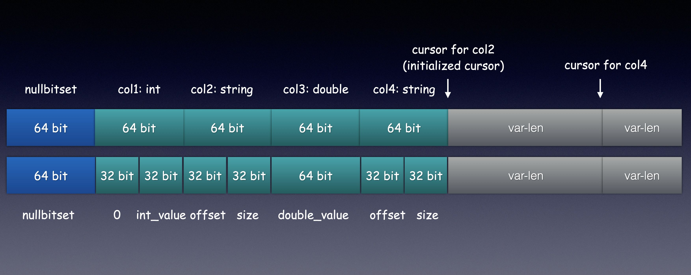

# UnsafeRow Codec Optimization

## Introduction

Spark UnsafeRow is the memory optimization in Catalyst and Tungsten modules. It is based on JVM Unsafe interfaces and reduce the overhead of JVM garbage collection.

## UnsafeRow Memory Layout

Spark UnsafeRow defines the memory layout of single row and all the data of the row is in the continuous memory. Here is the detail of the format.

* Align with 64 bits(8 bytes)
* Little endian
* Most data type uses the same 64 bits and the variable-length data is in the end

## SparkFE Codec

All the row data in Spark is using UnsafeRow by default. SparkFE has two ways to support Spark row format.

* Encode and decode mode, re-encode and re-decode for each columns which uses less memory but has overhead for codec.
* UnsafeRow-compatible mode, be compatible with UnsafeRow memory layout and eliminate the overhead of codec.

Refer to [SparkFE Configuration](../usage/sparkfe_configuration.md), we can enable the UnsafeRow optimization by the following configuration.

| Configuration | Introduction | Default | Note |
| ------------- | ------------ | ------- | ---- |
| sparkfe.enable.unsaferow.optimization | Enable UnsafeRow optimization or not | false | It can reduce 
